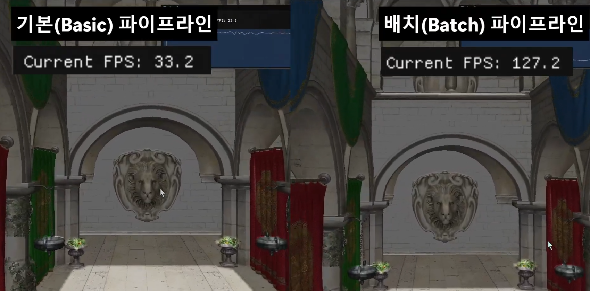

# Riche Renderer Vulkan

Riche is an experimental Vulkan renderer focused on modern GPU rendering
techniques, batching, culling, mesh shaders, ray-traced shadows, and runtime
texture generation experiments.

## Demo

The current demo compares the basic rendering pipeline with the batched
pipeline. In the captured scene, batching improves the frame rate from roughly
33 FPS to 127 FPS.



## Demo on YouTube

<p align="center">
  <a href="https://www.youtube.com/watch?v=x90SoRK9CGA">
    
  </a>
</p>

## Features

- View-frustum culling.
- Occlusion query culling and Hi-Z occlusion culling with compute shaders.
- Batch-based rendering with indirect draw buffers.
- Meshlet rendering through Vulkan mesh shaders.
- Ray-traced shadow experiments.
- Runtime texture replacement using Tiny Stable Diffusion.

## Requirements

- Windows with Visual Studio 2022.
- CMake 3.24 or newer.
- Vulkan SDK 1.3.290.0 or compatible.
- A GPU and driver with Vulkan support for the enabled rendering features.

## Build

Configure the Visual Studio project with CMake:

```powershell
cmake --preset vs2022-x64
```

Build Debug or Release:

```powershell
cmake --build --preset vs2022-debug
cmake --build --preset vs2022-release
```

The generated solution is located at:

```text
build/vs2022-x64/RicheVulkan.sln
```

The executable is written to `build/vs2022-x64/<Config>/Riche.exe`.

## Shaders

Shader SPIR-V files can be regenerated with the optional shader target:

```powershell
cmake --build build\vs2022-x64 --config Debug --target RicheShaders
```
